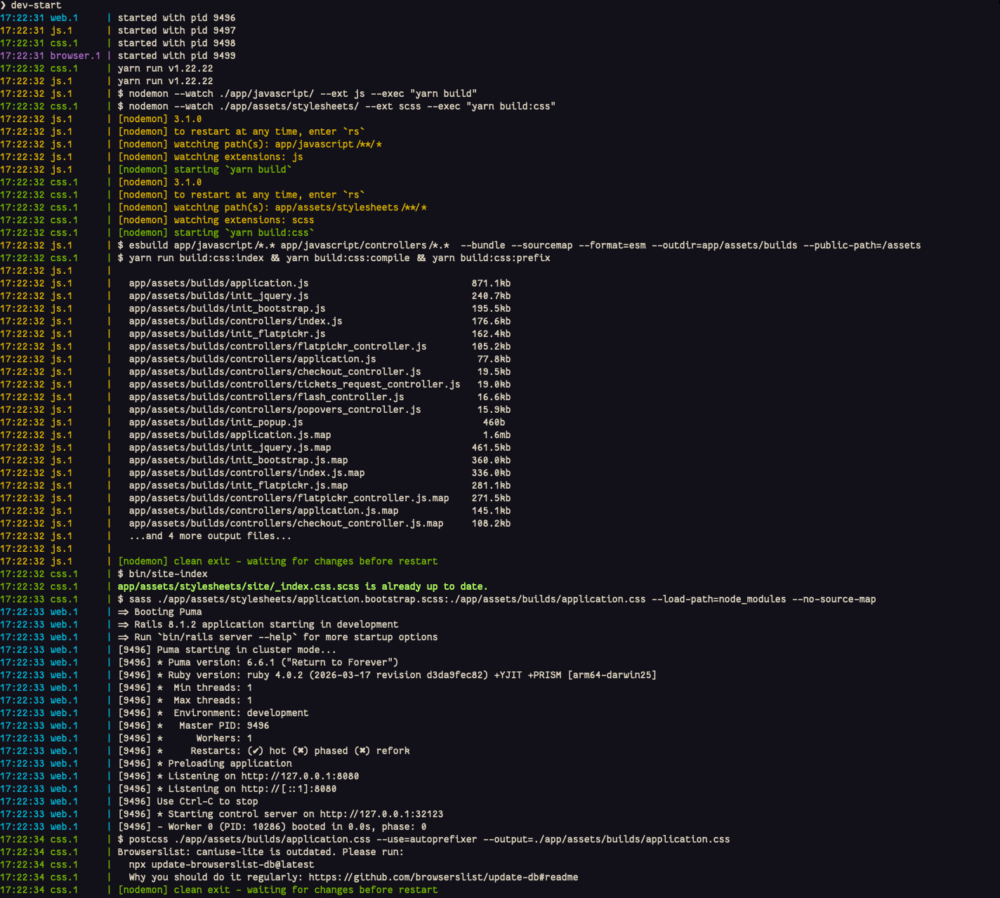
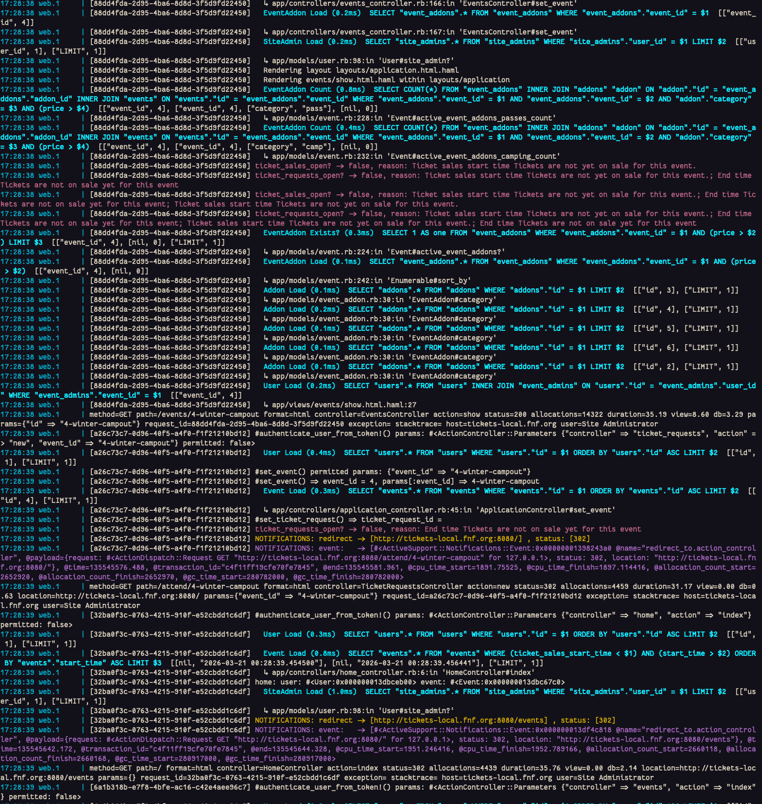
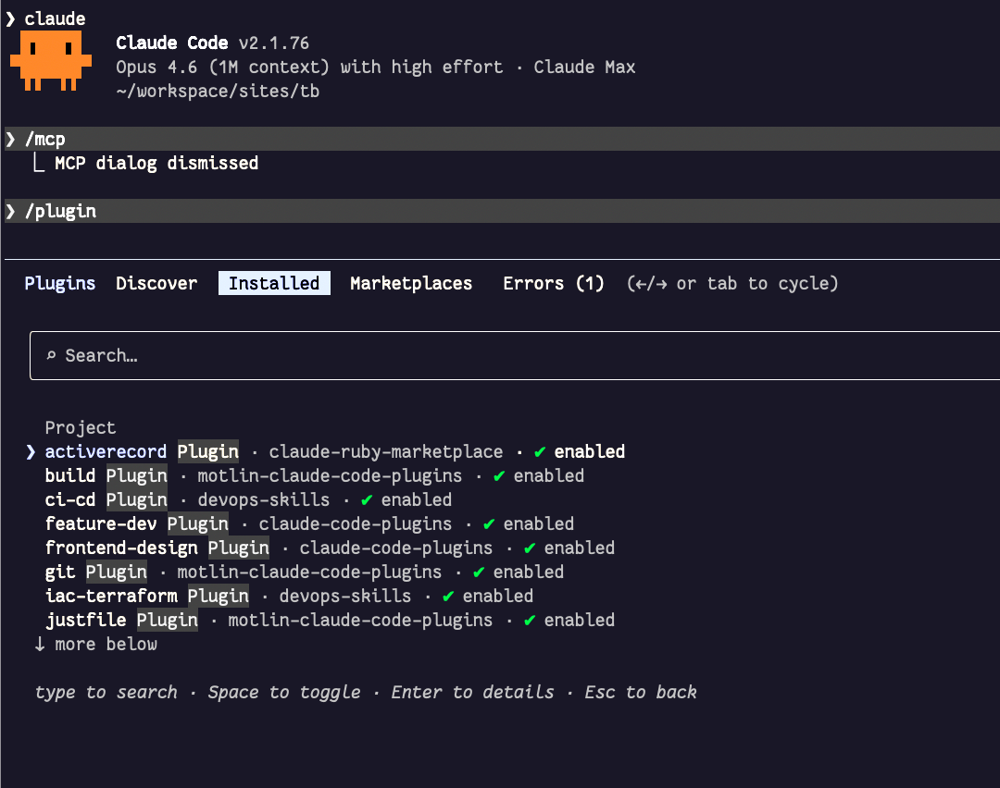
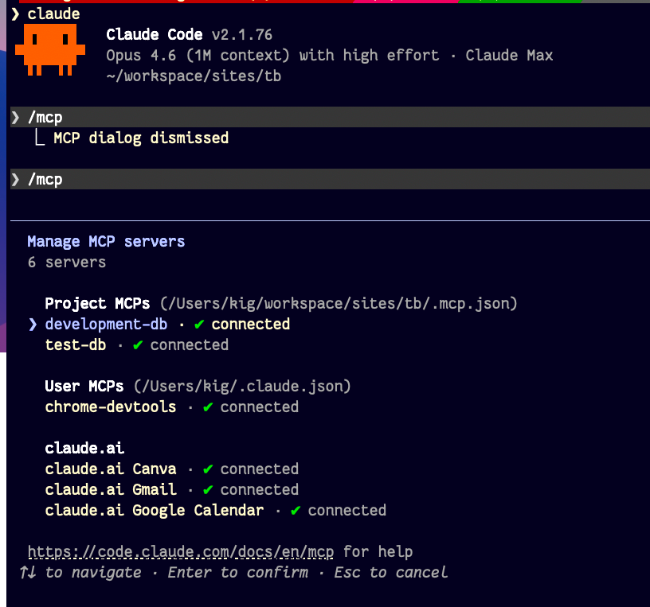
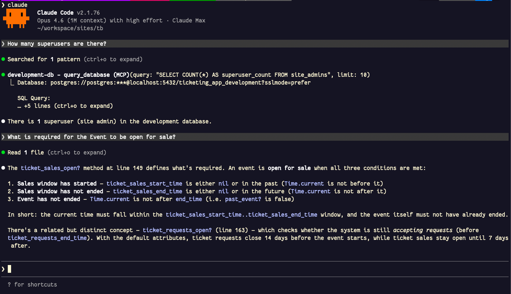

= Setting Up the App in Development
:doctype: book
:source-highlighter: rouge
:rouge-style: base16.monokai
:toclevels: 5
:toc:
:sectnums: 9
:icons: font
:license: MIT

== Getting Started with Coding TicketBooth

If you want to contribute to the TicketBooth codebase, there's a few things
you need to do in order to get started.

=== Pre-requisites

* Run a Mac or Linux operating system.
* XCode installed (or XCode Dev Tools)
* You probably are going to use https://brew.sh/[Homebrew] for installing package:

[source,bash]
----
/bin/bash -c "$(curl -fsSL https://raw.githubusercontent.com/Homebrew/install/HEAD/install.sh)"
----

=== Deploying to Production

We front-load this information so that you don't have to go search for it deep in the weeds of this document.

The deploy is performed via Capistrano, to an EC2 server where the app is running. http://kig.re[Konstantin Gredeskoul] maintains the server and owns the deploy process, and generally is the person who deploys the code.

[source,bash]
----
# Checkout the repo
git clone git@github.com:fnf-org/TicketBooth.git
cd TicketBooth
# Ensure you are on the main branch (ONLY deploy from the main branch!)
git checkout main
# Pull the latest changes
git pull
----

If you have not run the bin/dev-tooling script, you must, sorry. It might take a bit of time, but you do need it in order to have the proper ruby, gems and other dependencies installed.

NOTE: See the sections below for much more details about the `dev-tooling` script. We are mentioning it here because it is a prerequisite for deploying to production.

[source,bash]
----
bin/dev-tooling --help # read its help message
bin/dev-tooling # run it

# Ensure the tests and the linters are passing:
make ci
----

Once the tests and linters are passing, you can deploy to production:

[source,bash]
bin/deploy      # actually performs the deployment using Capistrano

If you want to add a version tag to the deployment, you can do so with `make tag` command.

==== Running Tests and Linters

To verify that your local environment is working, run the following:

[source,bash]
----
# Run the tests (specs)
bundle exec rspec
# Run rubocop linter
bundle exec rubocop
# Run shell linter
bin/shchk
----

Or you can run everything at once, with the convenient `make ci` command

[source,bash]
----
make ci
----

==== SSH Keys for Deployment 

If your SSH public key has been added to the production server's list of
authorized keys, you can deploy the latest version of the code to the
production site using `cap deploy` or `bin/deploy` commands. But before you do this, remember to push your local changes to the `origin` repository with `git push origin main`, as the deploy process can only deploy code from that canonical source.

If you don't have permission to deploy, you can submit a pull request to
the repository and someone will review your code and merge it if it's good
to go.

See https://help.github.com/articles/using-pull-requests[Using Pull Requests]
for more information on this process if you are not familiar.

---

Next, we are going to look at setting up your local dev environment properly, and without haste. Consider the above a compressed narrative of what's about to follow.

== Easy Route to Happiness

If you are on OS-X, you can use the provided `bin/dev-tooling` script to get your environment working with all of the necessary tools and dependencies. The script is generally kept up to date.

It has the following usage:

[source,bash]
----
❯ dev-tooling -h
USAGE:
  ./bin/dev-tooling [--help]  
                    [--vim] [--psqlrc] [--upgrade-brew]
                    [--skip-node] [--skip-db] [--skip-brew]

FLAGS:
  --vim    | -v  Install custom VIM configuration (and backup existing)
  --psqlrc | -p  Install ~/.psqlrc file configuration (recommended)
  --help   | -h  Show this help message
  --upgrade-brew Upgrade Brew packages. Otherwise uses locked versions.
  --skip-db      Do not setup the database or run migrations
  --skip-node    Do not install NodeJS or Yarn.
----

In most cases, just running `bin/dev-tooling` should be enough to get you started.

Running this script should get you:

* Many required, some optional but very useful tools and dependencies installed.
* VIM configuration installed (if you use it).
* `psql` initialization file installed (if you use it).
* Ruby, with version specified in the `.ruby-version` file installed.
* All the necessary Gems installed, as well as some external gems such as `ruby-lsp` necessary for IDE integration.
* NodeJS (LTS) installed using Volta, Yarn installed, and the project's dependencies installed.
* The database created, migrated, and seeded. 
* The script will also set up `direnv` to automatically load the environment variables from the `.envrc` file. 

And a bunch more stuff that's not listed here, but likely important.

[NOTE] 
.About using VIM Editor
==== 
If you've never used VIM, or you have your personal configuration that's deliberate and intentional, do not use the `--vim` flag. If, however, you are familiar with VIM, but haven't invested into a proper configuration, add `--vim` to the command line to install the custom configuration that got syntax highlighting, auto-complete, and other useful features.
====

[NOTE] 
.About using `psql` command
====
If you've never used the `psql` command and have no intention to, or vice versa, if you have your personal configuration that's deliberate and intentional, do not use the `--psqlrc` flag. If, however, you are familiar with `psql`, but haven't invested into a proper configuration, add `--psqlrc` to the command line to install the custom initialization file that will allow you to load SQL macros with `:m` or `:macros` command, and provides a nice looking prompt that shows you the database you are connected to and the version of PostgreSQL you are using, etc.
====

[NOTE] 
.About using `--upgrade-brew` flag
====
The `--upgrade-brew` flag is used to upgrade the Brew packages to the latest versions. If you don't use this flag, the script will use the locked versions of the packages, which might be outdated. But if you do use this flag, you will likely end up with an updated `Brewfile.lock.json` file, which you probably should commit to the repository together (or separately) with your changes.
====

=== Troubleshooting

If you run into any issues, contact Konstantin Gredeskoul at kig@fnf.org or kigster@gmail.com.

=== Starting the Dev Server

There are several largely equivalent ways to start the server:

* `make dev` - this will run the server using `foreman -f Procfile.dev`.
* `foreman -f Procfile.dev` - this will run the server using `foreman -f Procfile.dev` explicitly.
* `bin/dev-start` - this will run the server using `foreman -f Procfile.dev` as well.

All of the above commands will start the web server on port 8080, and the browser will open the URL automatically.

[IMPORTANT] 
.Why do we need to use foreman and the Procfile.dev?
==== 
Many "vanilla" Rails applications are started with the command `rails s`, which starts the Rails server.

However, we are using advanced CSS/JS pipeline that requires additional processes to be running in order to serve CSS and JS assets properly, and recompile them on the fly as they change. This is the primary reason for using `Procfile.dev` and the commands that use it listed above.
====

==== Booting Example

The following is a screen shot from starting the application in March 2026.

Once the application boots, it will open the URL http://tickets-local.fnf.org:8080[http://tickets-local.fnf.org:8080] in the browser.

After you login, and play around with the site you might see the following in the `log/development.log` file:

== Leveraging Claude and AI Tooling for Development

As of March 2026, we are using Claude Code (claude.ai/code) to help with development. You can read more about how Claude sees this app in the file xref:CLAUDE.md[CLAUDE.md].

If you install Claude Code CLI locally — typically this means running:

[source,bash]
curl -fsSL https://claude.ai/install.sh | bash

You can then run `claude` command in the project's root folder. If you also successfully completed running `bin/dev-tooling` you should a PostgreSQL MCP server available to you locally. 

=== Starting Claude

[source,bash]
claude

and once you get Claude's prompt, check out the command `/mcp` and `/plugins`. This will give you a sense of what's available.

==== Plugins

We install a few plugins to help with development.

The following plugins are installed:

* activerecord@claude-ruby-marketplace
* build@motlin-claude-code-plugins
* chrome-devtools-mcp@chrome-devtools-plugins
* ci-cd@devops-skills
* feature-dev@claude-code-plugins
* frontend-design@claude-code-plugins
* git@motlin-claude-code-plugins
* justfile@motlin-claude-code-plugins
* pr-review-toolkit@claude-code-plugins
* rspec@claude-ruby-marketplace
* ruby-skills@ruby-skills
* security-guidance@claude-code-plugins

==== MCP Servers

We start the PostgreSQL MCP server which is connected to both the development and test databases.

Installed by `bin/dev-tooling` is the PostgreSQL MCP server, which allows you to use pure English to query the database and ask questions about the code and the data. For example:

=== The State of Production (2026)

The production server is hosted on AWS EC2, and the application is deployed using Capistrano. It is always running generally and so should be available to access here: https://tickets.fnf.events[https://tickets.fnf.events]

You should be able to login or signup for an account year around, but only when an event is active and o

=== Some Notable Business Logic Details

You should also refer to the file xref:CLAUDE.md[CLAUDE.md] for more information about the application how it's structured.

==== Type of Users

There are 3 types of users:

* Site Admin (superuser)
* Event Admin
* User (regular user)

Only Site Admins can create new events, and add other users to an Event as Admins. Once an event is created and someone is assigned as an Event Admin, they can edit the event details, set the pricing, and other event-specific settings, and open up the event for ticket request collection.

==== Ticket Requests vs Tickets

Ticket requests are made by FnF community requesting any number of tickets, or addons such as RV camping, or early arrival or late departure passes, etc.

Event admins manually review each ticket request, and can approve or decline them. If approved, the user is then able to purchase for the tickets via a Stripe Integration web form (Stripe Checkout), and once paid, the ticket request contains the information about the number of tickets purchased, and the names. 

To deploy to production site —  — the deployer's IP address must be white-listed with EC2. Contact Konstantin Gredeskoul to get white-listed. 

NOTE: At the moment the architecture of the site is such that we do not yet create the actual individual tickets in the database for each user. This is a TODO item, and may be implemented in the future. 

=== API Testing

HTTP API Specs mock calls to external APIs using a record and replay model with the utility called https://github.com/vcr/vcr[VCR].

Most definitely read through the https://benoittgt.github.io/vcr/#/[VCR documentation] if you are working on any of the API specs.

Some organizational information:

* Cassettes are stored in `spec/fixtures/vcr_cassettes` folder
* If an API changes due to version, response, etc... you will need to rebuild cassettes for those specs (delete the directory and/or files for the specs that have changed).
* Delete the directory and/or files for the specs that have changed.
* It is ok to delete all cassettes and regenerate everything.
* This can be done in your local development environment.
* VCR is configured in `spec/spec_helper.rb`.

You must filter any API keys before you check in the cassettes to prevent leaking keys to GitHub (our repo is public!). See the https://benoittgt.github.io/vcr/#/configuration/filter_sensitive_data[Filtering Sensitive Data] section for more information.

To enable vcr recording on a given spec, add a vcr hook to the spec as follows

[source,ruby]
----
it 'does not change payment intent', :vcr do
  expect { payment_intent }.not_to(change(payment, :payment_intent))
end
----

To turn off VCR HTTP request interception for a given spec or block, add

[source,ruby]
----
VCR.turned_off do
 make_request "In VCR.turned_off block"
end

make_request "Outside of VCR.turned_off block"

VCR.turn_off!
make_request "After calling VCR.turn_off!"

VCR.turned_on do
  make_request "In VCR.turned_on block"
end

VCR.turn_on!
make_request "After calling VCR.turn_on!"
----

For more information please see the https://benoittgt.github.io/vcr/#/cassettes/no_cassette[No Cassette] section of the VCR documentation.

To turn off VCR by default for http requests see the https://benoittgt.github.io/vcr/#/configuration/allow_http_connections_when_no_cassette[Allow HTTP Connections When No Cassette] section of the VCR documentation.

== Manual Setup

If you are a masochist, you can follow the steps below to set up the environment manually. Good luck with that.

NOTE: The steps below may be outdated. The `bin/dev-tooling` script is the **up-to-date** way to set up the environment.

=== Ruby

* You are probably going to need `rbenv` and `ruby-build`:

[source,bash]
----
# ensure that failed commands do not terminate the shell
set +e

# install rbenv
brew update && brew install rbenv ruby-build direnv

# now let's make sure we enable rbenv in our shell init file at the very end:
init="${HOME}/.zshrc"
grep -q "rbenv init" "${init}"  || echo 'eval "$(rbenv init - zsh)"' >> "${init}"
grep -q "direnv hook" "${init}" || echo 'eval "$(direnv hook zsh)"' >> "${init}"

# load it up to activate rbenv in this session
source ~/.zshrc
----

=== Checkout the Source

* Clone this repository:

[source,bash]
----
cd ~/ && mkdir -p workspace/fnf/ && cd workspace/fnf
git clone git@github.com:fnf-org/ticket-booth.git && cd ticket-booth

# enable auto-loading of the .envrc file
direnv allow .

# Install the appropriate version of Ruby
rbenv install -s $(cat .ruby-version)

# Install bundler, and install the dependend gems
gem install bundler --version 2.3.11 -N
bundle install -j 12
----

=== Configuration

* Copy the `config/database.yml.example` file to `config/database.yml`, and
edit the `username` and `password` fields to match the user/password you
chose in the previous step (you can use the defaults if you want).

* Copy the `config/stripe.yml.example` file to `config/stripe.yml`. If you
have your own Stripe account that you want to test with, use the secret
key and public key from that account instead (but the defaults will work
out of the box if you don't want to use your own Stripe account).

* Create the databases using the information you defined in
`config/database.yml` by running `rake db:create`

* Fill the database with tables by running the database migrations:
`rake db:migrate db:test:prepare`
** NOTE - the `db:test:prepare` is necessary only if you want to run the tests

You should now be all set. Try spinning up a local development server by
running:

[source,bash]
bundle exec rails server

OR
[source,bash]
bundle exec puma -C config/puma.rb

This should run an all-in-one server that you can access from your browser
at http://localhost:3000[http://localhost:3000]. It will also automatically load any changes
you make to code in the repo's `app` directory. Changes anywhere else will
require you to restart the server.

If you want to work within a Ruby console, `rails console` is incredibly
useful for playing around in the Rails environment.

== Contributing

=== Write helpful commit messages

When making changes to the code, ensure your commit messages are descriptive.
A good summary of git commit messages can be found
http://tbaggery.com/2008/04/19/a-note-about-git-commit-messages.html[here],
but you can look at the repository history for some examples using `git log`.

=== Write tests

Automated tests are your friend. See the `spec` directory for examples.
You can run the automated tests by running `bundle exec rspec spec`
(where `spec` is the directory of specs, or individual list of specs, that you
want to run) in the repository.

Check the `coverage` folder, eg.

[source,bash]
bundle exec rspec && open coverage/index.html

To run both the specs and rubocop:
[source,bash]
rake
