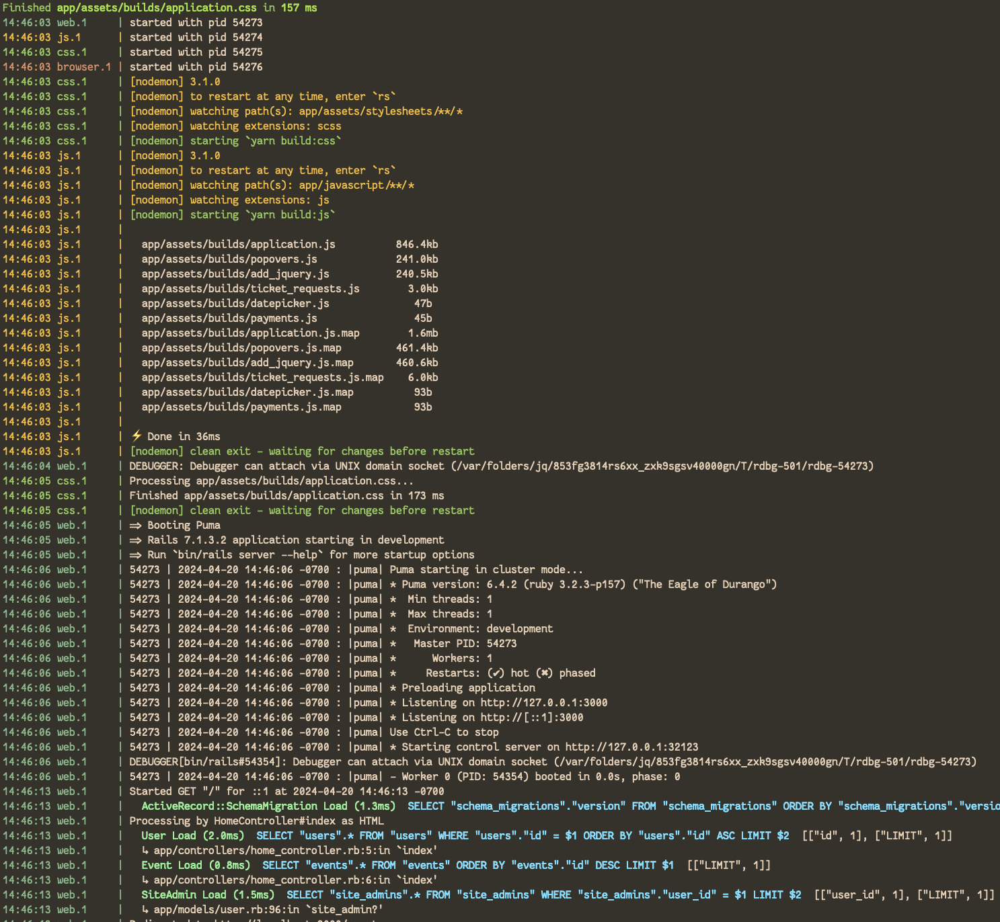

= Ticket Booth
:doctype: book
:source-highlighter: rouge
:rouge-style: base16.monokai
:toc:
:icons: font
:license: MIT

====
image::https://github.com/fnf-org/TicketBooth/actions/workflows/rspec.yml/badge.svg[TicketBooth CI: RSpec,link=https://github.com/fnf-org/TicketBooth/actions/workflows/rspec.yml]

image::https://github.com/fnf-org/TicketBooth/actions/workflows/lint.yml/badge.svg[TicketBooth CI: RuboCop,link=https://github.com/fnf-org/TicketBooth/actions/workflows/lint.yml]

image:https://github.com/fnf-org/TicketBooth/actions/workflows/build.yaml/badge.svg[Docker Image Build,link="https://github.com/fnf-org/TicketBooth/actions/workflows/build.yaml"]
====

NOTE: This app is formerly known as **Helping Culture**, which in turn was originally conceived and inspired by Tracy Page. This project was originally written by https://github.com/sds[Shane de Silva]. It is currently maintained by the https://github.com/fnf-org[FnF] org, and within it specifically https://github.com/kigster[Konstantin Gredeskoul] for any application issues, and https://github.com/mike-matera[Mike Matera] for any issues related to deployment to the Google Public Cloud. Please use labels to tag any reported issues.

== Welcome to the *Ticket Booth*!

=== Ticket Booth is an open source Rails App meant to be self-hosted

The goal of the app is to make ticket and volunteer management for community events easier and automated.

=== Initialization

Please make sure you have PostgreSQL running locally, or install it via Homebrew:

[source,bash]
----
bin/boot-up
----

After that:

[source,bash]
----
brew install rbenv ruby-build
eval "$(rbenv init -)"
rbenv install -s $(cat .ruby-version)
rbenv local $(cat .ruby-version)
bundle install
bundle exec rake db:create
bundle exec rake db:migrate db:seed
bundle exec rake db:test:prepare
bundle exec rspec
----

=== Starting the Server

We recommend that you use the `Makefile`:

[source,bash]
----
make development boot
----

Here is an example:

=== Tooling

==== Adding Site Admin

When the database is completely blank, the first step is to create the initial account. Lets say you registered as 'kig@fnf.org':

The second step is to make that person a site admin:

[source,bash]
----
RAILS_ENV=production
bin/site-admin add kig@fnf.org

# Or, to remove site admin from a given user:
bin/site-admin remove kig@fnf.org
----

==== Generating Music Submissions List

The repo contains a convenient script for generating HTML to embed into the Wordpress site, using a CSV generated out of Google Spreadsheet collected using Google Forms.

The CSV must contain three columns and a header row:

 * DJ Name
 * Full Name
 * Set URL

To generate the HTML (we'll use the CSV file checked into the fixtures):

[source,bash]
----
bin/music-submission-links spec/fixtures/chill_sets.csv [ --simple-css ] > chill_set.html
open chill_set.html
----

NOTE: if you add `--simple-css` to the arguments, the generated HTML will include `<head>` element with the [Simple CSS Stylesheet](https://simplecss.org/).

Now you can open WordPress, create a two-column layout and paste the contents into one of the two columns.

To verify that the script is working, install a handy tool called `highlight`:

[source,bash]
----
npm i -g highlight
bin/music-submission-links spec/fixtures/chill_sets.csv | highlight -l html
----

=== Developer Setup

We dedicated a separate document to the xref:DEVELOPERS.pdf[developer setup], which helps you get the application running locally.

== API Documentation

Yard-generated documentation is available via running:

[source,bash]
----
bundle exec rake doc
# this will automatically open the index.html
----

b

